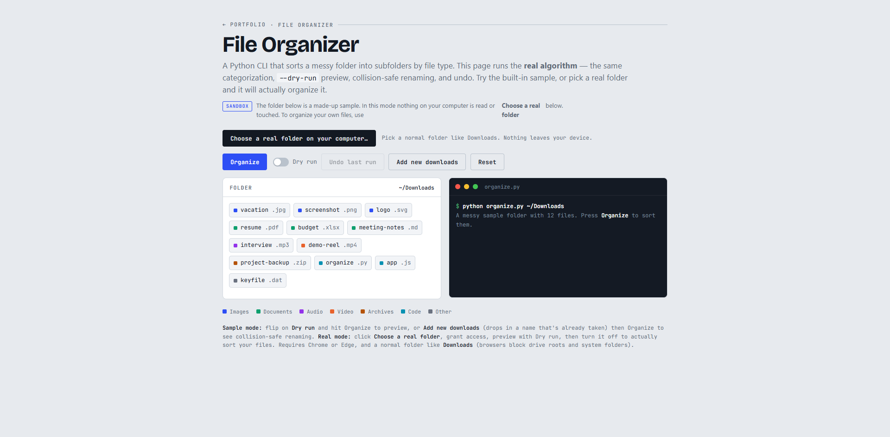

# File Organizer

A command-line tool that automatically sorts the files in a folder into
subfolders by type — images, documents, audio, video, archives, code, and
more. Built as a practical Python automation utility.

**▶ [Live demo](https://ryanwien.github.io/Portfolio2026/file-organizer/demo.html)** — an interactive, in-browser walkthrough running the real algorithm: dry-run preview, collision-safe renaming, and undo.



## What it does

Point it at a messy folder (like a Downloads directory) and it moves every
file into a category subfolder based on its extension:

```
Downloads/                      Downloads/
  photo.jpg                       Images/photo.jpg
  report.pdf          ──►         Documents/report.pdf
  song.mp3                        Audio/song.mp3
  archive.zip                     Archives/archive.zip
  script.py                       Code/script.py
```

## Features

- **Dry-run mode** — preview exactly what will happen before any file is moved.
- **Safe collision handling** — if a file with the same name already exists, the
  tool renames the new one (`report_1.pdf`) instead of overwriting.
- **Undo** — every run writes a log file, and you can fully reverse it with one
  command.
- **Configurable rules** — categories and extensions are defined in one place
  and easy to extend.
- **Zero dependencies** — uses only the Python standard library.

## Usage

```bash
# Preview what would happen (recommended first step)
python organize.py ~/Downloads --dry-run

# Actually organize the folder
python organize.py ~/Downloads

# Undo a previous run using its generated log file
python organize.py ~/Downloads --undo organize_log_20260630_213845.json
```

## How it works

1. **Scan** the target folder for files (ignoring subfolders and hidden files).
2. **Categorize** each file by looking up its extension in the category rules.
3. **Resolve collisions** so an existing file is never overwritten.
4. **Move** each file into its category subfolder (or just print the plan in
   dry-run mode).
5. **Log** every move to a JSON file so the operation can be undone.

## Design decisions

- **Dry-run by request** — destructive operations (moving files) should always
  be previewable. The `--dry-run` flag runs the entire logic and reports the
  plan without touching the filesystem.
- **Never overwrite** — collision resolution guarantees no data is lost, even if
  two files share a name.
- **Undo via logging** — rather than tracking state in memory, each run persists
  a simple JSON record of every move, making the undo operation trivial and
  transparent.
- **Standard library only** — `pathlib`, `shutil`, `argparse`, and `json` cover
  everything, so the tool runs anywhere Python does with no installation.

## Possible next steps

- Recursive mode to organize nested folders
- Sort by date (year/month) in addition to type
- A config file for custom rules instead of editing the script
- A simple GUI wrapper

## Tech stack

Python (standard library: pathlib, shutil, argparse, json)
