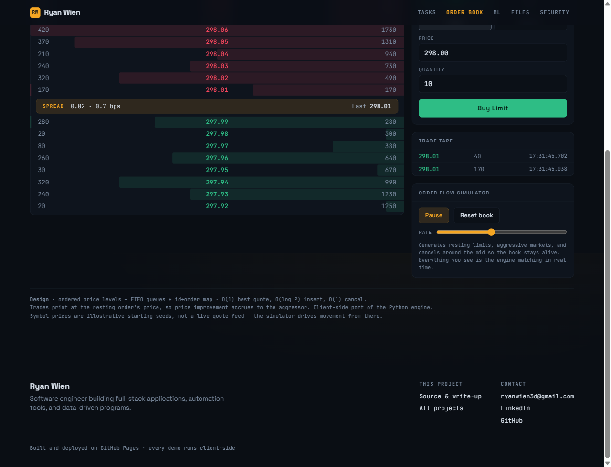

# Limit Order Book & Matching Engine

A price-time-priority matching engine is the core of any exchange. Incoming
orders match against the opposite side of the book best-price-first, and ties
at a price are broken by arrival time (FIFO). Written to be read: the design
choices below are the point.

**▶ [Live demo](https://ryanwien.github.io/Portfolio2026/matching-engine/orderbook_terminal.html)** — an interactive, zero-backend trading terminal with a live depth ladder and order-flow simulator.



**Implementations:** C++20 (`cpp/`) · Python (`book.py`) · JavaScript (the terminal).
The C++ and Python engines replay a shared scenario and produce identical trades —
see [C++ implementation](#c-implementation) for the equivalence check and latency figures.


## Quick start

```bash
pip install -r requirements.txt
python demo.py         # annotated walkthrough
```

## What it does

- **Limit & market orders** on both sides
- **Matching** with price priority across levels and time priority within a level
- **Partial fills** — remainder of a limit order rests on the book; an unfilled
  market remainder is discarded
- **Price improvement** accrues to the incoming order (trades print at the
  resting order's price — standard convention)
- **O(1) cancellation** of any resting order
- **Top-of-book / depth** snapshots

## Design: why not two heaps?

The tempting answer to "best bid / best ask" is a max-heap for bids and a
min-heap for asks. It's the wrong tool, and explaining why is the interesting
part:

| Operation            | Two heaps      | This design            |
|----------------------|----------------|------------------------|
| Best bid / ask       | O(1)           | O(1)                   |
| Insert resting order | O(log N)       | O(log P)               |
| **Cancel an order**  | **O(N)**       | **O(1)**               |
| Time priority        | manual seq nos | free (FIFO queue)      |

`N` = total orders, `P` = distinct price levels (`P ≪ N` in practice). Real
order flow is cancel-heavy — most orders never trade — so O(n) cancels are
disqualifying. The structure exchanges actually use:

```
bids: SortedDict  price -> PriceLevel   (best bid = highest price)
asks: SortedDict  price -> PriceLevel   (best ask = lowest  price)
                              │
                              └── FIFO doubly-linked list of orders (time priority)

orders: dict  order_id -> Order          (O(1) lookup for cancel)
```

Three ideas working together:

1. **Ordered map of price levels** (`sortedcontainers.SortedDict`, a B-tree)
   → O(log P) to find/create a level, O(1) to read the best price.
2. **FIFO doubly-linked list per level** → time priority is automatic; append
   at the tail, match from the head.
3. **Intrusive linked list + id→order map** → the `prev`/`next` pointers live
   on the `Order` itself, so a cancel looks the order up in the dict and
   unlinks it in O(1) with no queue scan.

## Complexity summary

| Operation      | Cost      |
|----------------|-----------|
| submit (per level touched) | O(log P) |
| best bid / ask | O(1)      |
| cancel         | O(1)      |
| depth(k)       | O(k)      |

## Files

- `order.py` — `Order` (also a list node), `Trade`, enums
- `book.py` — `PriceLevel` and the `OrderBook` engine
- `demo.py` — annotated end-to-end scenario
- `reference_trace.py` / `reference_scenario.txt` — shared scenario both engines replay
- `cpp/` — the C++20 implementation, tests, and latency benchmark
- `orderbook_terminal.html` — live browser front end (see below)

## Front end: live order book terminal

`orderbook_terminal.html` is a single self-contained file — no build, no
backend. Open it (or deploy it as `index.html` on GitHub Pages) and it boots
into a running market:

- **Depth ladder** with size bars and a live spread band
- **Order entry** (buy/sell, limit/market); click any level to load its price
- **Trade tape** of executions, timestamped to the millisecond
- **Order-flow simulator** generating limits, markets, and cancels around the mid
- **Symbol basket** (AAPL, MSFT, NVDA, AMZN, GOOGL, META, TSLA, JPM) with
  realistic seed prices — illustrative starting points, not a live feed

The matching logic is the same price-time-priority design as the Python
engine, ported to JavaScript, so one design is shown in two languages.

## C++ implementation

Real matching engines are written in C++, so this one is too — [`cpp/`](cpp/),
C++20, the same price-time-priority design.

```bash
cd cpp
cmake -B build && cmake --build build   # portable
build.bat                               # or MSVC directly

build\reference_trace.exe   # replay the shared scenario
build\tests.exe             # 56 assertions
build\benchmark.exe         # latency distribution
```

**Proving the two agree.** Both engines replay
[`reference_scenario.txt`](reference_scenario.txt) — a fixed sequence covering
time priority at equal prices, partial fills, sweeps across levels, market
orders, cancels, and an order that rests untouched. Each prints every trade and
the final book, and the two outputs are **identical**:

```bash
python reference_trace.py > py.txt
cpp/build/reference_trace.exe reference_scenario.txt > cpp.txt
diff py.txt cpp.txt        # no output
```

**Latency**, averaged over 256-operation batches, release build:

| operation | mean | p50 | p99 | p99.9 |
|-----------|-----:|----:|----:|------:|
| submit | 115 ns | 113 ns | 163 ns | 302 ns |
| cancel | 19 ns | 19 ns | 34 ns | 44 ns |
| best bid + ask | 1.3 ns | 1.2 ns | 1.6 ns | 2.0 ns |

The gap between cancel and submit is the entire argument for the data
structure. Cancel never searches: the id map holds a pointer straight to the
owning price level and an iterator to the order, so it unlinks in constant time
and only touches the ordered map when a level empties. Submit pays `O(log P)`
to locate its level. With a heap, cancel would be the `O(n)` operation — and
cancels outnumber fills in real order flow.

Two measurement details, because a benchmark that flatters itself is worthless.
Operations are timed in batches: `steady_clock` on Windows ticks at ~100 ns, so
timing a single ~100 ns operation reports 0, 100 or 200 ns and nothing between —
precise-looking noise. And cancels are gated on a depth floor, because flow that
cancels as fast as it adds drains the book, and an empty book makes every
operation look fast for the wrong reason.

One deliberate difference from a production engine: prices are `double` here to
stay faithful to the Python reference. A real venue uses integer ticks, because
binary floating point cannot represent a cent exactly.

## Natural extensions (good talking points)

- **More order types**: IOC (immediate-or-cancel), FOK (fill-or-kill),
  stop / stop-limit, post-only.
- **Self-trade prevention**: cancel or decrement when a participant would
  cross their own resting order.
- **Thread safety / throughput**: a single-writer event loop fed by a lock-free
  queue is the usual answer — one thread owns the book, so no per-order locking.
- **Market-data feed**: emit L2 depth deltas and a trade tape to subscribers.
- **FIX protocol** front end for order entry.
- **Persistence / replay**: append-only event log so the book can be rebuilt
  deterministically after a crash.
- **Integer tick prices** in the C++ engine, replacing `double`, so a cent is
  represented exactly rather than approximately.
