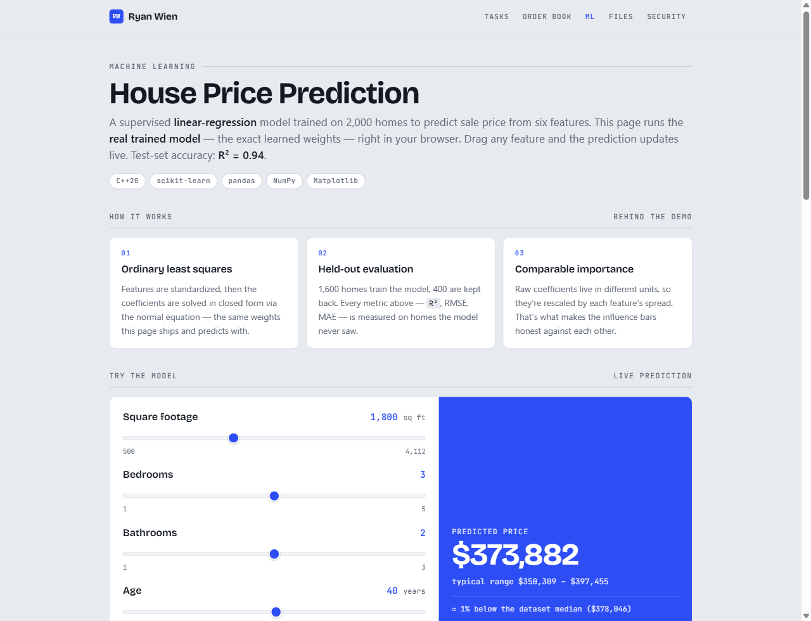

# House Price Prediction — Supervised ML Regression

A linear regression project that predicts house prices from property
features, applying the core concepts from Andrew Ng's *Supervised Machine
Learning: Regression and Classification* course to a fresh dataset.

**▶ [Live demo](https://ryanwien.github.io/Portfolio2026/ml-housing/demo.html)** — an interactive predictor running the real trained model in your browser: drag the property features and watch the price update, with model metrics and an actual-vs-predicted plot.



**Implementations:** Python / scikit-learn (`house_price_regression.py`) · C++20 (`cpp/`) · JavaScript (the demo).
Both train on the same frozen split and agree on every coefficient to four decimals —
see [C++ implementation](#c-implementation).


## What it does

Given six features of a house — square footage, bedrooms, bathrooms, age,
garage spaces, and a neighborhood desirability score — the model predicts its
sale price. On held-out test data it explains **94% of the variance in price
(R² = 0.94)**, with a typical error around $19,000.

## Concepts demonstrated

This project walks through the standard supervised-learning workflow taught in
the course:

1. **Data exploration** — inspecting shape, ranges, and feature/target
   correlations to understand the problem before modeling.
2. **Train/test split** — holding out 20% of the data so performance is
   measured on examples the model never saw during training.
3. **Feature scaling (standardization)** — putting every feature on the same
   scale so gradient descent converges efficiently. Without scaling, large-scale
   features like square footage would dominate small-scale ones like bedroom
   count.
4. **Gradient descent** — training a linear model by iteratively minimizing
   mean squared error (`SGDRegressor`).
5. **Closed-form baseline** — solving the same problem with the normal equation
   (`LinearRegression`) to confirm gradient descent converged to the right
   answer. Both reach an identical R² of 0.94, which validates the training.
6. **Evaluation** — reporting RMSE, MAE, and R², the standard regression
   metrics.
7. **Interpretation** — because features are standardized, the learned weights
   are directly comparable, revealing which features drive price most
   (square footage and location, as expected).

## Running it

```bash
pip install -r requirements.txt
python house_price_regression.py
```

## Sample output

```
LEARNED FEATURE WEIGHTS (on standardized features)
  sqft                    +86,179
  location_score          +37,966
  age                     -18,898
  bedrooms                +10,582
  bathrooms                +9,764
  garage                   +5,267
```

The model correctly learns that square footage has the largest positive effect
on price and that age has a negative effect — matching real-world intuition.

## About the dataset

`data/housing.csv` is a synthetic dataset of 2,000 houses, generated with known
underlying relationships plus realistic noise. Using synthetic data keeps the
project fully reproducible (no external downloads) while still exercising the
complete regression workflow. The generation logic could be swapped for any
real CSV with a `price` column and numeric features.

## C++ implementation

The same model in **C++20** under [`cpp/`](cpp/), with no linear-algebra
dependency — the normal equations are formed and solved by hand with
Gauss-Jordan elimination and partial pivoting, which is the part worth writing
yourself.

```bash
cd cpp
cmake -B build && cmake --build build   # portable
build.bat                               # or MSVC directly

cd ..                       # run from ml-housing so data/ is found
cpp\build\train.exe         # train and report
cpp\build\tests.exe         # 46 assertions
```

**Reproducing the same model, not a similar one.** `train_test_split` is
reproducible inside scikit-learn, but matching it from C++ would mean
reimplementing NumPy's Mersenne Twister permutation — brittle, and not what this
project is about. So the split is exported once by
[`export_split.py`](export_split.py) into `data/split_indices.txt` and committed.
Both implementations train on precisely the same 1,600 rows, and the C++ solver
lands on the Python coefficients to four decimal places:

| | intercept | sqft | bedrooms | bathrooms | age | garage | location |
|---|---:|---:|---:|---:|---:|---:|---:|
| Python | 6516.3289 | 147.9107 | 7449.5246 | 11998.2683 | -811.0954 | 6348.7842 | 14704.7599 |
| C++ | 6516.3289 | 147.9107 | 7449.5246 | 11998.2683 | -811.0954 | 6348.7842 | 14704.7599 |

Test-set R² agrees to nine decimal places (0.944734826). The tests assert those
values directly, so the two can't quietly drift apart.

One honest discrepancy: the standardized weights printed above come from
`SGDRegressor`, and gradient descent stops *near* the optimum rather than on it.
The C++ solver is exact, so it reports `sqft` at +86,194 against SGD's +86,179 —
a 0.02% gap. That difference is the point of keeping the closed-form baseline in
the Python script: it's how you check that gradient descent actually converged.

## Keeping the browser demo honest

`demo.html` carries the trained model inline so it can predict with no backend.
Those numbers were originally pasted in by hand, and had drifted: the demo was
serving a model with R² 0.9433 while the committed code and data produce
0.9447 — a different split, fossilised in the page.

[`export_model.py`](export_model.py) now regenerates that whole block —
coefficients, metrics, feature statistics and the scatter sample — from the CSV
and the frozen split, so the demo, the Python script, and the C++ implementation
all describe the same model:

```bash
python export_split.py    # once, to freeze the split
python export_model.py    # rewrites the model block in demo.html
```

## Possible next steps

- Add polynomial features to capture non-linear relationships
- Regularization (Ridge / Lasso) to study overfitting
- Cross-validation for more robust performance estimates
- A classification variant (e.g. predicting price *tier* instead of exact price)

## Tech stack

Python · scikit-learn · pandas · NumPy · **C++20** (dependency-free solver)
