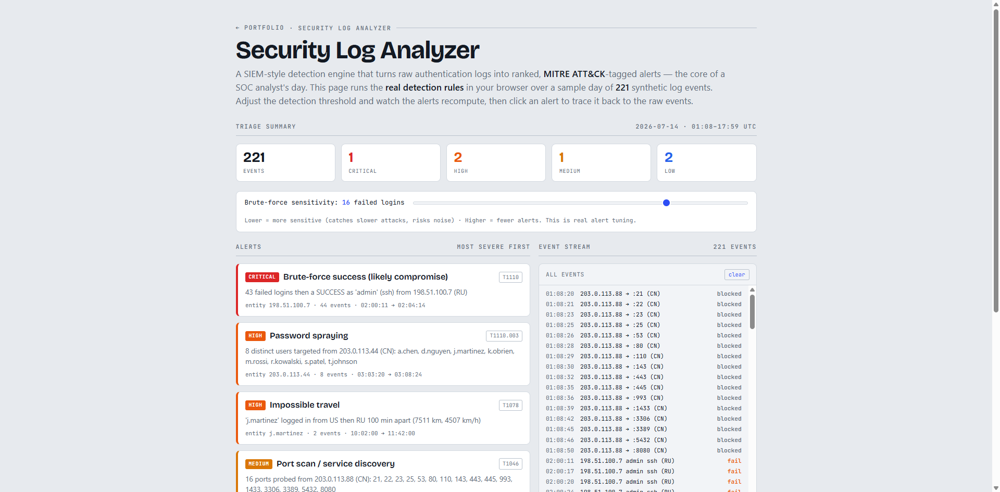

# Security Log Analyzer — SIEM-style Threat Detection

A detection engine that ingests authentication/access logs and turns them into
ranked, **MITRE ATT&CK**-tagged alerts — the core task a SOC analyst performs
against a SIEM (Splunk, Microsoft Sentinel, Elastic) every day. Built while
working through the **Microsoft Cybersecurity Analyst** certificate.

**▶ [Live demo](https://ryanwien.github.io/Portfolio2026/security-log-analyzer/demo.html)** — a SOC console running the real detection rules in your browser: ranked alert cards, a tunable brute-force threshold, and click-to-trace from any alert back to the raw events.



## What it does

Point it at a log of login/probe events and it flags the patterns that matter,
each with a severity and the ATT&CK technique it maps to:

| Detection | What it catches | Severity | ATT&CK |
|-----------|-----------------|----------|--------|
| Brute force | Many failed logins from one source IP in a short window | HIGH | [T1110](https://attack.mitre.org/techniques/T1110/) |
| Brute-force success | A successful login right after a failed burst — likely compromise | CRITICAL | [T1110](https://attack.mitre.org/techniques/T1110/) |
| Password spraying | One source trying a few passwords across many accounts | HIGH | [T1110.003](https://attack.mitre.org/techniques/T1110/003/) |
| Port scan | One source probing many ports/services quickly | MEDIUM | [T1046](https://attack.mitre.org/techniques/T1046/) |
| Impossible travel | One user, two logins too far apart to be physically possible | HIGH | [T1078](https://attack.mitre.org/techniques/T1078/) |
| Off-hours privileged access | Admin/service account logins outside business hours | LOW | [T1078](https://attack.mitre.org/techniques/T1078/) |

Every rule is **thresholded** (see `DEFAULTS` in `analyze.py`), because the real
work of detection engineering is tuning sensitivity to balance catching attacks
against drowning in false positives.

## Usage

```bash
python analyze.py                        # analyze the bundled sample log
python analyze.py path/to/events.jsonl   # analyze your own log
python analyze.py --format json          # machine-readable alerts (for a SIEM/SOAR)
python analyze.py --bf-threshold 5       # tune brute-force sensitivity
```

No installation needed — Python standard library only.

## Run it on your own machine (Windows)

The bundled log is synthetic, but you can point the analyzer at your **real
Windows logon history**. `collect_windows.ps1` pulls your logon events into the
JSON Lines format and writes them locally — nothing is uploaded:

```powershell
# From the security-log-analyzer folder:
powershell -ExecutionPolicy Bypass -File collect_windows.ps1 -Hours 168
python analyze.py data/windows_events.jsonl
```

It reads two sources, in order:

1. The **Security log** (Event IDs 4624 / 4625) — the canonical SOC source,
   including *failed* logons, so the brute-force and spraying detections fire.
   Run PowerShell **as administrator** for this (the Security log is protected).
2. **TerminalServices session logons** (no admin needed) — successful
   console/RDP sessions only.

A clean run with **no alerts is the expected, healthy result** for a personal
machine. To see detections fire on real data, run elevated on a host that has
seen failed logons (e.g. an internet-exposed RDP server). Your collected log is
git-ignored, so it never leaves your machine.

## Sample output

```text
====================================================================
SECURITY LOG ANALYSIS
====================================================================
  Events analyzed: 221
  Time range:      2026-07-14T01:08:20Z  ->  2026-07-14T17:59:47Z
  Alerts:          6  (CRIT 1 | HIGH 2 | MED 1 | LOW 2)
--------------------------------------------------------------------

  [CRITICAL] Brute-force success (likely compromise)  (T1110)
    entity : 198.51.100.7
    detail : 43 failed logins then a SUCCESS as 'admin' (ssh) from 198.51.100.7 (RU)
    window : 2026-07-14T02:00:11Z -> 2026-07-14T02:04:14Z  (44 events)

  [HIGH] Impossible travel  (T1078)
    entity : j.martinez
    detail : 'j.martinez' logged in from US then RU 100 min apart (7511 km, 4507 km/h)
    window : 2026-07-14T10:02:00Z -> 2026-07-14T11:42:00Z  (2 events)
  ...
```

## Input format

JSON Lines (one event per line):

```json
{"ts":"2026-07-14T02:00:11Z","src_ip":"198.51.100.7","country":"RU","lat":55.75,"lon":37.62,"user":"admin","service":"ssh","port":22,"action":"login","status":"fail"}
```

## Design decisions

- **Detection as thresholded rules** — each rule is a small, testable function
  over the event stream. Sliding time windows drive the brute-force and
  port-scan detections; a geo-velocity (haversine) check drives impossible
  travel. Thresholds live in one place so sensitivity is easy to tune.
- **Map everything to ATT&CK** — alerts carry a technique ID, the shared
  language every SOC and threat-intel team uses. It makes findings actionable
  and comparable across tools.
- **Rank by severity** — a `CRITICAL` compromise (brute force *then a success*)
  is separated from a `HIGH` brute-force attempt, so an analyst triages the real
  incident first.
- **Synthetic data, self-contained** — the sample log is generated, so nothing
  sensitive is involved and the tool (and its browser demo) run anywhere.
- **One engine, two front-ends** — the browser demo re-implements the exact same
  rules the Python CLI runs, over the exact same sample log.

## What this demonstrates

Skills central to a SOC analyst role and the **Microsoft Cybersecurity Analyst**
curriculum:

- **Detection engineering** — writing and tuning rules that turn raw telemetry
  into actionable alerts (the SIEM query/analytics workflow behind Microsoft
  Sentinel and KQL).
- **MITRE ATT&CK** — mapping observed activity to a shared technique taxonomy so
  findings are comparable and actionable.
- **Incident triage** — severity ranking so the genuine compromise (brute force
  *then* a success) surfaces above lower-priority noise.
- **Threat recognition** — brute force, password spraying, account compromise,
  network reconnaissance, and anomalous sign-ins (impossible travel).

## Possible next steps

- More detections: credential-stuffing, lateral movement, data-exfil volume
- Parse real log formats directly (Linux `auth.log`, Windows Security events, IIS/nginx)
- Emit alerts as [Sigma](https://github.com/SigmaHQ/sigma) rules for portability
- Stateful correlation across multiple log sources

## Tech stack

Python (standard library: `json`, `datetime`, `math`, `argparse`, `collections`).
Browser demo: vanilla JavaScript, no dependencies.
