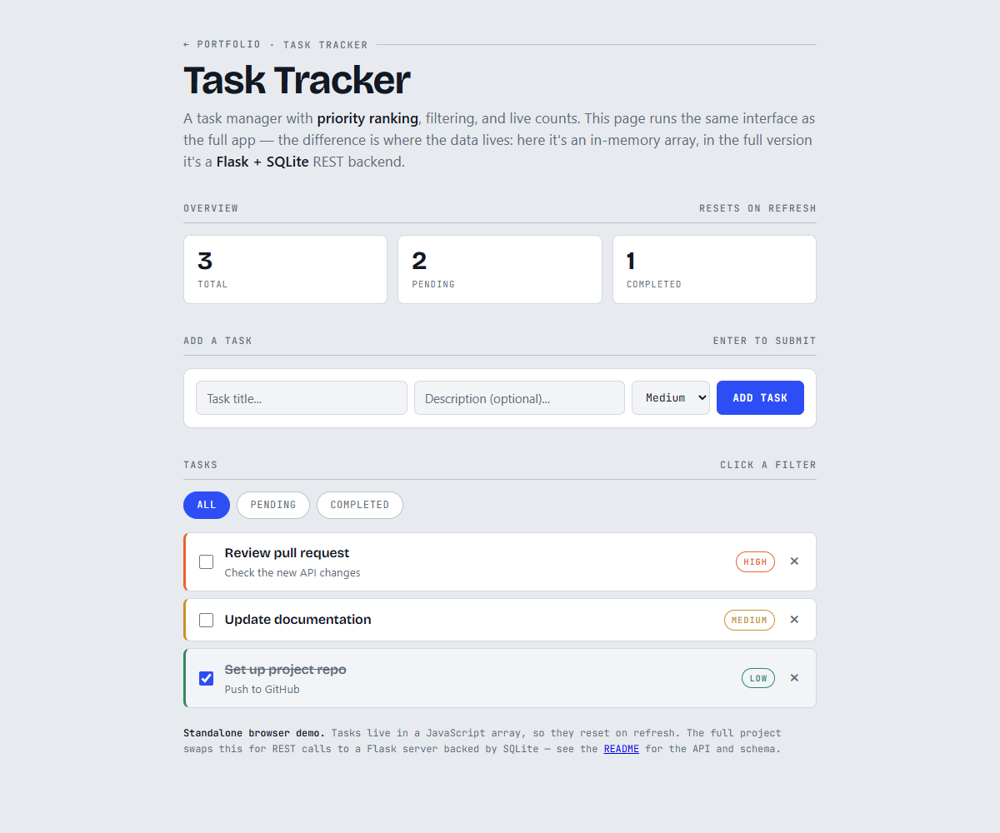

# Task Tracker

A full-stack task management web application with a REST API backend and a
vanilla-JavaScript frontend. Built to practice clean API design, database
operations, and integration between the frontend and the backend.

**▶ [Live demo](https://ryanwien.github.io/Portfolio2026/task-tracker/demo.html)**. A self-contained, in-browser walkthrough of the UI (no backend required).



**Implementations:** C# / ASP.NET Core 9 (`csharp/`) · Python / Flask (`backend/`) · JavaScript (the demo).
Both backends serve the same REST contract, so the front end works against either.
See [C# implementation](#c-implementation).


## Overview

Task Tracker lets a user create, view, update, complete, and delete tasks,
each with a title, description, and priority level. The app shows live summary
statistics and supports filtering by completion status.

It is intentionally built **without frontend frameworks** so that every part of
the data flow (HTTP requests, JSON handling, and DOM updates) is explicit and
easy to follow.

## Architecture

```
┌─────────────────┐        HTTP / JSON        ┌──────────────────┐
│   Frontend      │  ───────────────────────► │   Flask API      │
│  (HTML/CSS/JS)  │                            │   (Python)       │
│                 │  ◄───────────────────────  │                  │
└─────────────────┘                            └────────┬─────────┘
                                                        │ SQL
                                                ┌───────▼────────┐
                                                │  SQLite DB     │
                                                └────────────────┘
```

- **Frontend:** plain HTML, CSS, and JavaScript. Uses the `fetch` API to call
  the backend and updates the DOM with the results.
- **Backend:** a Flask REST API exposing CRUD endpoints plus a stats endpoint.
- **Database:** SQLite, accessed through parameterized queries to prevent
  SQL injection.

## REST API

| Method | Endpoint              | Description                          |
|--------|-----------------------|--------------------------------------|
| GET    | `/api/tasks`          | List all tasks (optional `?completed=true\|false`) |
| GET    | `/api/tasks/<id>`     | Get a single task                    |
| POST   | `/api/tasks`          | Create a task                        |
| PUT    | `/api/tasks/<id>`     | Update a task (partial updates ok)   |
| DELETE | `/api/tasks/<id>`     | Delete a task                        |
| GET    | `/api/stats`          | Summary counts (total/pending/done)  |

### Example request

```bash
curl -X POST http://localhost:5000/api/tasks \
  -H "Content-Type: application/json" \
  -d '{"title": "Write README", "priority": "high"}'
```

## Running locally

### Backend

```bash
cd backend
pip install -r requirements.txt
python app.py
```

The API starts on `http://localhost:5000`.

### Frontend

Open `frontend/index.html` in a browser, or serve it with any static server:

```bash
cd frontend
python -m http.server 8000
```

Then visit `http://localhost:8000`.

## Design decisions

- **Parameterized SQL queries** everywhere (`?` placeholders) to prevent SQL
  injection. User input is never concatenated into query strings.
- **Server-side input validation:** the API rejects tasks without a title and
  validates the priority field, rather than trusting the client.
- **HTML escaping on the frontend:** user-entered text is escaped before being
  inserted into the DOM, a basic guard against XSS.
- **Separation of concerns:** database access, request handling, and rendering
  are kept in distinct functions so each piece can be understood and changed
  independently.
- **No frontend framework:** kept deliberately dependency-light so the core
  mechanics (fetch, JSON, DOM) are visible rather than hidden behind a library.

## Possible next steps

- User accounts and authentication
- Due dates and sorting
- Move from SQLite to PostgreSQL for multi-user deployment
- Automated tests (pytest for the API)
- Deploy to a cloud host

## C# implementation

The same REST API in **C# / ASP.NET Core 9 + EF Core**, under [`csharp/`](csharp/),
the stack this kind of CRUD service is most often built on in industry.

```bash
cd csharp
dotnet run --project src/TaskTracker.Api      # http://localhost:5000
dotnet test tests/TaskTracker.Tests           # 22 tests
```

It implements the same contract as the Flask backend: same routes, same JSON
field names (`created_at`, not `createdAt`), same error strings. The existing
front end can point at either without a change.

The 22 tests boot the real application through `WebApplicationFactory` against
a throwaway SQLite file, so they exercise the actual HTTP pipeline, routing,
model binding and EF Core rather than a stand-in. They cover CRUD, the
`?completed=` filter, partial updates leaving untouched fields alone, the
validation rules, 404s, and stats staying self-consistent, plus two
SQL-injection payloads that must round-trip as ordinary text.

Two things are tightened relative to the Flask version. Listing orders by
`created_at` **and then by id**, because two tasks created in the same instant
would otherwise come back in an order SQLite doesn't guarantee between runs.
And `PUT` rejects a blank title instead of accepting it, which the Flask
version allows: it validates the title on create but not on update.

## Tech stack

Python · Flask · SQLite · JavaScript (ES6) · HTML5 · CSS3
· C# · ASP.NET Core 9 · EF Core

## Live demo

`demo.html` is a standalone, no-setup version you can open directly in a
browser, useful for quickly seeing the interface without running the backend.
It keeps tasks in memory (data resets on refresh). The full application
(`backend/app.py` + `frontend/`) uses a real Flask REST API and SQLite database.
